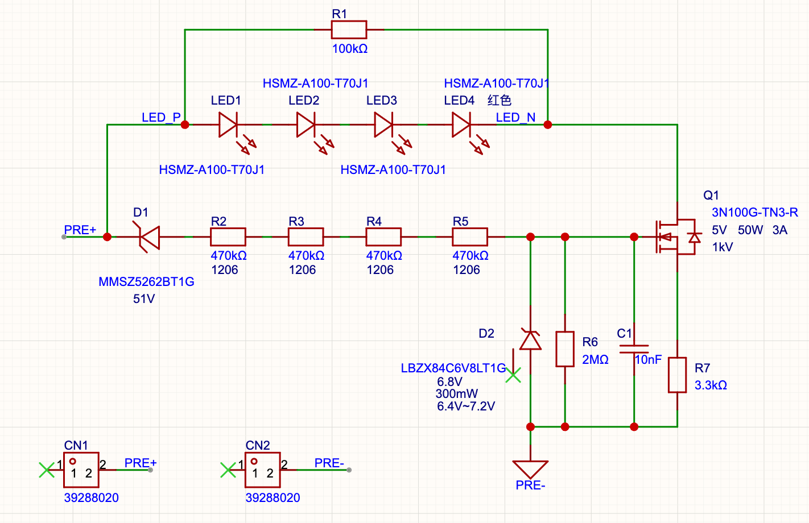

# FSAE 电池箱高压指示灯 (HV Indicator) 电路

## 一、 设计概述与应用场景

根据 FSAE/FSEC 赛事规则，电池箱必须配备一个在电压高于 60VDC 时发亮、直接由高压总线供电且不受软件控制的高压指示灯。

本电路采用**基于高压 N 沟道 MOSFET 的线性恒流源拓扑**，结合分立式稳压二极管网络实现阈值判定。该电路将高压母线的大幅波动（60V ~ 600V）转化为对 LED 的稳定微小电流驱动，具有高可靠性、抗干扰能力强等特点。

## 二、 电路拓扑与功能模块描述

本电路主要由以下四个功能回路构成：

1. **高压阈值判定与分压网络：** 
   由 51V 稳压二极管 D1 (MMSZ5262BT1G)、串联降压电阻链 R2~R5（4 颗 470kΩ，共 1.88MΩ）以及下拉电阻 R6（2MΩ）组成。D1 物理阻断低压段电流，R2~R6 构成电阻分压器，为 MOSFET 提供开启偏置电压，同时 R6 为 D1 的反向漏电流提供泄放路径。
2. **栅极安全钳位与滤波：** 
   由 6.8V 稳压二极管 D2 (LBZX84C6V8LT1G) 和旁路电容 C1 (10nF) 组成。D2 确保在 600V 极限输入时，MOSFET 栅极电压不超限；C1 吸收来自母线的高频开关噪声，防止 MOSFET 发生高频自激振荡。
3. **主功率恒流控制 (Source Follower)：** 
   由 1000V N 沟道 MOSFET Q1 (3N100G-TN3-R) 与源极反馈电阻 R7 (3.3kΩ) 组成。该拓扑利用 MOSFET 的转移特性，将流经主回路的电流稳定在毫安级别。
4. **视觉指示与微光消除 (Anti-Ghosting)：** 
   由 4 颗串联的 AlInGaP 高亮红色 LED (HSMZ-A100-T70J1) 与并联泄放电阻 R1 (100kΩ) 组成。多颗串联实现在微电流下扩大发光面积；R1 用于旁路 MOSFET 关断状态下的漏电流（$I_{DSS}$），防止指示灯在低于阈值电压时出现不合规的微弱发光。

## 三、 参数定量计算与非理想特性分析

### 3.1 启动阈值电压 ($V_{start}$) 计算
启动阈值定义为 MOSFET 栅极电压 $V_G$ 达到其导通阈值 $V_{GS(th)}$ 时，高压端 (PRE+) 所需的最低电压。

*   **设定点：** 查阅 UTC 3N100-C 规格书，在极小电流（如 $250\mu A$）下，$V_{GS(th)}$ 典型值为 **4.0V**。
*   **控制支路电流：** 当 $V_G = 4.0V$ 时，流经下拉电阻 R6 (2MΩ) 的电流 $I_{div}$ 为：
    $$I_{div} = \frac{4.0\text{V}}{2\text{M}\Omega} = 2\mu\text{A}$$
*   **电阻链压降：** R2 至 R5 (总阻值 1.88MΩ) 上的压降为：
    $$V_{R2-R5} = 2\mu\text{A} \times 1.88\text{M}\Omega = 3.76\text{V}$$
*   **D1 (51V) 实际压降：** 规格书中 MMSZ5262B 的 51V 标称值是在 $I_{ZT} = 2.5\text{mA}$ 时测得的。在 $2\mu\text{A}$ 的微电流下，齐纳二极管处于软击穿区（Soft-knee），实际端电压会有所下降，合理估算在 **48V ~ 49V** 之间（取 48.5V）。
*   **综合启动电压 ($V_{start}$)：**
    $$V_{start} = V_{D1} + V_{R2-R5} + V_G \approx 48.5\text{V} + 3.76\text{V} + 4.0\text{V} = 56.26\text{V}$$
**【结论】**：指示灯将在母线电压达到约 **56V ~ 58V** 时开始亮起。符合“高于 60VDC 必须发亮”的规则要求，并预留了合理的器件公差裕量。

### 3.2 稳态恒流值 ($I_D$) 计算
当母线电压上升至最高工作电压（如 **600V**）时，需计算流经 LED 的稳态电流。

*   **控制支路电流：** $I_{div(max)} \approx \frac{600\text{V} - 51\text{V} - 6.8\text{V}}{1.88\text{M}\Omega} \approx 288\mu\text{A}$
*   **D2 实际钳位电压：** 查阅 LBZX84C6V8LT1G 规格书，6.8V 标称值是在较大电流下测得。在 $\approx 288\mu\text{A}$ 的偏置电流下，其实际钳位电压 $V_G$ 预计在 **5.8V ~ 6.0V** 之间。
*   **恒流平衡方程：**
    设 MOSFET 处于轻载状态下的 $V_{GS} \approx 3.5\text{V}$，源极电阻 R7 为 3.3kΩ：
    $$I_D = \frac{V_G - V_{GS}}{R_7} \approx \frac{5.9\text{V} - 3.5\text{V}}{3300\Omega} \approx 0.73\text{mA}$$
**【结论】**：无论母线电压在 80V 还是 600V 波动，流经 LED 的稳态电流被硬件闭环限制在 **0.6mA ~ 0.8mA** 之间，实现了亮度的一致性。在该电流下，实测4 颗 HSMZ-A100-T70J1 串联的发光亮度能够满足指示要求。

### 3.3 漏电流引起的“微光”消除分析 (R1 作用)
*   **漏电流源：** 根据 3N100-C 规格书，在 $V_{DS} = 1000\text{V}$ 时，最大关断漏电流 $I_{DSS} = 10\mu\text{A}$。此外，D1 在未击穿前也存在数百纳安的漏电流。
*   **无 R1 的风险：** 这微安级漏电流若直接穿过高效 LED（如 HSMZ-A100），会导致低于 60V 时 LED 依然发出暗光（鬼影）。
*   **R1 的作用：** 并联 R1 (100kΩ) 后，假设极端的 $10\mu\text{A}$ 漏电流全部流过 R1，产生的压降为：
    $$V_{R1} = 10\mu\text{A} \times 100\text{k}\Omega = 1.0\text{V}$$
    4 颗红色 LED 串联需要约 **6.4V ~ 7.2V** 的正向电压才能导通。由于 $1.0\text{V} \ll 6.4\text{V}$，LED 阵列被完全短路保护，处于深度截止状态。

## 四、 热设计与安全工作区 (SOA) 评估

主功率回路（LED 支路）直接并联在母线 `PRE+` 上，绕过了用于阈值判定的 51V 稳压管 D1。

1. **MOSFET 极限功耗 ($P_{Q1}$)：**
   主回路由 `PRE+` 经过 4 颗 LED、MOSFET Q1、反馈电阻 R7 到地。
   根据基尔霍夫电压定律，Q1 两端的漏源电压 $V_{DS}$ 为：
   $$V_{DS} = V_{PRE+} - (4 \times V_{LED}) - V_{R7}$$
   
   已知：
   *   极限最高母线电压 $V_{PRE+} = 600\text{V}$
   *   红光 LED 正向压降 $V_{LED} \approx 1.9\text{V}$（4颗共约 $7.6\text{V}$）
   *   恒流反馈电阻压降 $V_{R7} = I_D \times R_7 \approx 0.8\text{mA} \times 3.3\text{k}\Omega \approx 2.6\text{V}$

   代入计算：
   $$V_{DS} \approx 600\text{V} - 7.6\text{V} - 2.6\text{V} = 589.8\text{V}$$
   
   取估算电流上限 $I_D = 0.8\text{mA}$：
   $$P_{Q1} = V_{DS} \times I_D = 589.8\text{V} \times 0.0008\text{A} \approx \mathbf{0.47\text{W}}$$

1. **器件温升 ($T_J$) 验算：**
   3N100-C 采用 TO-252 封装，查阅规格书，在标准 FR-4 PCB（无大面积覆铜）上的结到环境热阻 $\theta_{JA}$ 典型值为 **110°C/W**。
   MOSFET 的自身温升 $\Delta T$ 为：
   $$\Delta T = P_{Q1} \times \theta_{JA} = 0.47\text{W} \times 110^\circ\text{C/W} = 51.7^\circ\text{C}$$
   
   假设电池箱内部因电池发热及阳光暴晒，极限环境温度达到 **60°C**，则 MOSFET 内部结温 $T_J$ 为：
   $$T_J = T_A + \Delta T = 60^\circ\text{C} + 51.7^\circ\text{C} = \mathbf{111.7^\circ\text{C}}$$
低于器件绝对最大额定结温（150°C）。
## 五、 元器件选型规范与 BOM 表

高压电路的选型不仅看电气参数，**封装间距** 也是合规的核心要求。

| 编号         | 规格/型号                 | 封装        | 选型依据与工程规范要求                                                                                           |
| :--------- | :-------------------- | :-------- | :---------------------------------------------------------------------------------------------------- |
| **Q1**     | UTC 3N100G-TN3-R      | TO-252    | **核心功率管。** 耐压 1000V，提供 66% 的电压裕量。选择 TO-252 封装以承受 ~0.5W 的热耗散。                                          |
| **D1**     | MMSZ5262BT1G (51V)    | SOD-123   | **启动阈值阻断。** SOD-123 封装的引脚间距满足 51V 的耐压及爬电要求。                                                           |
| **D2**     | LBZX84C6V8LT1G (6.8V) | SOT-23    | **栅极钳位保护。** 响应速度快，防止瞬态高压击穿 MOSFET 栅源极。                                                                |
| **LED1-4** | HSMZ-A100-T70J1       | PLCC-2    | **发光单元。** 汽车级 AllnGaP 技术，光效高，120° 宽视角。4颗串联弥补低电流驱动下的亮度，形成面光源。                                          |
| **R2-R5**  | 470kΩ, ±1%, 1/4W      | **1206**  | **高压分压链。需采用 1206 封装以满足耐压要求。** 600V 高压由 4 颗电阻分担，每颗承受约 140V。此部分阻值调整对电路影响较小，一般无需改动；若需调整，建议总阻值不低于 1.5MΩ。 |
| **R6**     | 2MΩ, ±1%              | 0805/1206 | 栅极下拉电阻。工作电压低（<10V），对封装无高压要求。可选阻值区间：1MΩ ~ 3.3MΩ                                                      |
| **R1**     | 100kΩ, ±5%            | 0805/1206 | 漏电流旁路电阻，承受电压极低（<5V）。                                                                                  |
| **R7**     | 3.3kΩ, ±1%            | 0805/1206 | 恒流反馈电阻，决定 LED 电流大小。                                                                                   |
| **C1**     | 10nF, 50V             | 0603/0805 | 栅极高频旁路电容，选用常规 X7R/X5R 材质即可。                                                                           |

## 六、 补充说明

1. **高压熔断保护：** 
   本原理图中未绘出熔断器。在实际应用中，**PRE+ 进线端与本电路板之间必须串联高压熔断器**（建议规格 100mA ~ 500mA，耐压需满足母线要求）。
2. **PCB 散热设计：** 
   PCB 布局时，建议在 Q1 (TO-252) 的漏极（Drain）覆铜焊盘处，增加敷铜面积并打密集热过孔连接至底层，必要时可增加辅助散热结构（如：散热铝鳍片）。
3. **绝缘隔离：** 
   需确保可靠的电气绝缘。可进行三防漆涂覆处理，或将组装好的 PCB 放置于阻燃外壳内，并使用透明灌封胶进行整体灌封。
4. **合规标识：** 
   外壳或发光窗口旁需清晰张贴符合赛事规则的标识（如“Voltage Indicator”）。

### 6.1 阈值调整说明
原方案在采用 MMSZ5262BT1G（51V）结合 1.88MΩ 与 2MΩ 分压网络时，实测约在 59.6V 亮起，较为接近 60V 的规则下限。
若需预留更多裕量（将阈值下调约 2V），建议更改以下器件：
*   稳压二极管 D1 替换为 47V 规格（如 MMSZ5261BT1G）。
*   下拉电阻 R6 由 2MΩ 调整为 1.3MΩ。

### 6.2 主功率管封装替换建议
可将 `3N100G-TN3-R`（TO-252 贴片封装）替换为 Vishay 的 `IRFBG30PbF`（TO-220 直插封装）。
*   **阈值影响：** `3N100G-TN3-R` 的 $V_{GS(th)}$ 典型值为 4.0V，而 `IRFBG30PBF` 的典型值更低。若直接替换，电路的启动阈值电压 $V_{start}$ 会整体下移约 1V。
*   **电流与发热：** 替换后，稳态恒流阶段由 R7 设定的恒流 $I_D$ 会略微增大（约 $0.88\text{mA}$）。由于 TO-220 封装的结到环境热阻 $\theta_{JA}$（$62^\circ\text{C/W}$）远低于 TO-252（$110^\circ\text{C/W}$），自身温升将从约 $51.7^\circ\text{C}$ 显著降至约 $32.2^\circ\text{C}$。
*   **结论：** 改用 TO-220 封装的 IRFBG30 后，发热量显著降低。若需进一步提高指示灯亮度，可适当减小恒流反馈电阻的阻值。
*   **安装建议：** 对于 TO-220 直插封装，建议将引脚折弯使其平铺贴附于 PCB 上，并通过螺丝或导热硅橡胶等进行固定。